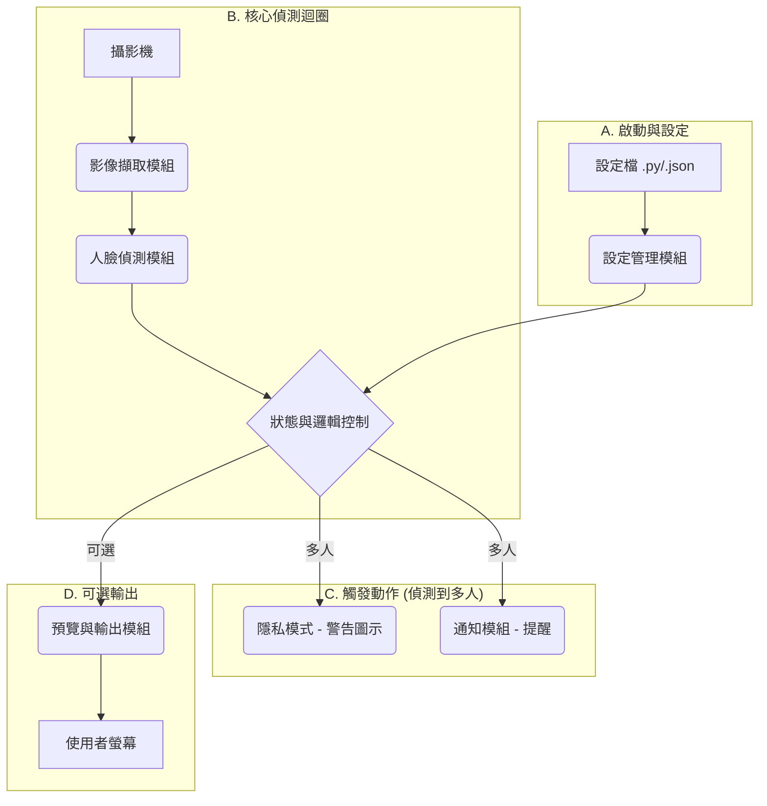

# 軟體服務架構：即時隱私保護服務 (v3)

## 1. 總覽

本服務是一個動態隱私保護助理，旨在即時保護用戶的螢幕內容隱私。它透過攝影機偵測畫面中的人臉數量，當偵測到多個（大於等於2個）人臉時，系統將自動啟動「隱私模式」，**顯示一個全螢幕的警告圖示來遮擋畫面**。此架構反映了 `main.py` 的現有設計，並明確了隱私模式的目標實作方式。

## 2. 系統元件

此服務由以下幾個核心元件組成：

### 2.1. 設定管理模組 (Configuration Module)

* **功能**: 負責載入系統設定。它會先讀取 `config.py` 中的預設參數，然後嘗試讀取 `privacy_guard_config.json`（如果存在），讓使用者可以自訂設定以覆寫預設值。
* **對應程式碼**: `load_user_config` 方法。

### 2.2. 影像擷取模組 (Video Capture Module)

* **功能**: 從指定的攝影機來源即時擷取影像畫面。
* **技術**: 使用 `OpenCV` 函式庫。
* **對應程式碼**: `initialize_camera` 方法。

### 2.3. 人臉偵測模組 (Face Detection Module)

* **功能**: 分析每一幀畫面，找出所有人臉的位置與數量。此模組使用一個 ONNX 模型進行推論。它會處理模型的熱圖 (heatmap) 輸出來定位人臉，並使用 `scipy` 進行連通元件分析以提高準確性。若未安裝 `scipy`，則會降級使用一個較簡單的偵測算法。
* **技術**: `onnxruntime`, `numpy`, `scipy` (可選)。
* **對應程式碼**: `load_model`, `detect_faces`, `_detect_faces_simple` 方法。

### 2.4. 狀態與邏輯控制模組 (State & Logic Control Module)

* **功能**:
    1. 根據人臉偵測模組回傳的人臉數量，更新系統的隱私狀態 (`self.privacy_mode`)。
    2. 包含一個延遲機制 (`PRIVACY_DELAY`)，避免因短暫的人臉出現而頻繁切換狀態。
    3. 管理程式的運行狀態 (`self.is_running`)。
* **對應程式碼**: `update_privacy_status` 方法。

### 2.5. 隱私模式模組 (Privacy Mode Module) - **目標實作**

* **功能**: 當被邏輯控制模組啟動時，它會**建立一個全螢幕、半透明的黑色浮層。在這個浮層的中央，會顯示一個醒目的警告圖示（例如一個鎖或眼睛的圖案），並附上簡短的警告文字，如『隱私模式已啟動』。這個浮層會保持在所有視窗的最上層，有效遮擋螢幕內容。**
* **技術**: 使用 `PyQt` 或 `Tkinter` 等 GUI 函式庫來建立一個置頂的、無邊框的透明視窗。
* **注意**: **這是我們期望達到的功能，與 `main.py` 目前的實作不同。**

### 2.6. 通知模組 (Notification Module) - **目前實作**

* **功能**: 作為目前版本的「隱私模式」替代方案。當偵測到多人時，它會透過多種方式提醒使用者：
  * 在終端機印出日誌訊息。
  * (macOS) 顯示系統桌面通知。
  * (macOS) 播放系統提示音。
* **對應程式碼**: `create_privacy_overlay` 方法。

### 2.7. 預覽與輸出模組 (Preview & Display Module)

* **功能**: (可選) 如果使用者啟用預覽模式 (`ENABLE_FACE_PREVIEW`)，此模組會建立一個視窗，顯示攝影機的即時畫面。畫面上會繪製出偵測到的人臉方框、信賴度分數以及目前的系統狀態（安全/隱私模式）。
* **技術**: `OpenCV`。
* **對應程式碼**: `run_detection_loop` 中的 `cv2.imshow` 相關部分。

## 3. 執行緒模型 (Threading Model)

程式具備兩種執行模式：

1. **前景模式 (主執行緒)**: 當啟用預覽視窗時，所有任務在主執行緒中運行，以便處理 GUI 事件。
2. **背景模式 (獨立執行緒)**: 當禁用預覽時，人臉偵測的核心迴圈 (`run_detection_loop`) 會在一個獨立的背景執行緒中運行，主執行緒則等待中斷訊號，這樣可以降低資源佔用。

* **對應程式碼**: `start` 方法中的邏輯判斷。

## 4. 資料流程

## 5. 主要依賴套件

* `opencv-python`
* `numpy`
* `onnxruntime`
* `pyautogui`
* `Pillow`
* `scipy` (建議安裝)
* `PyQt5` 或 `Tkinter` (用於隱私模式浮層)
